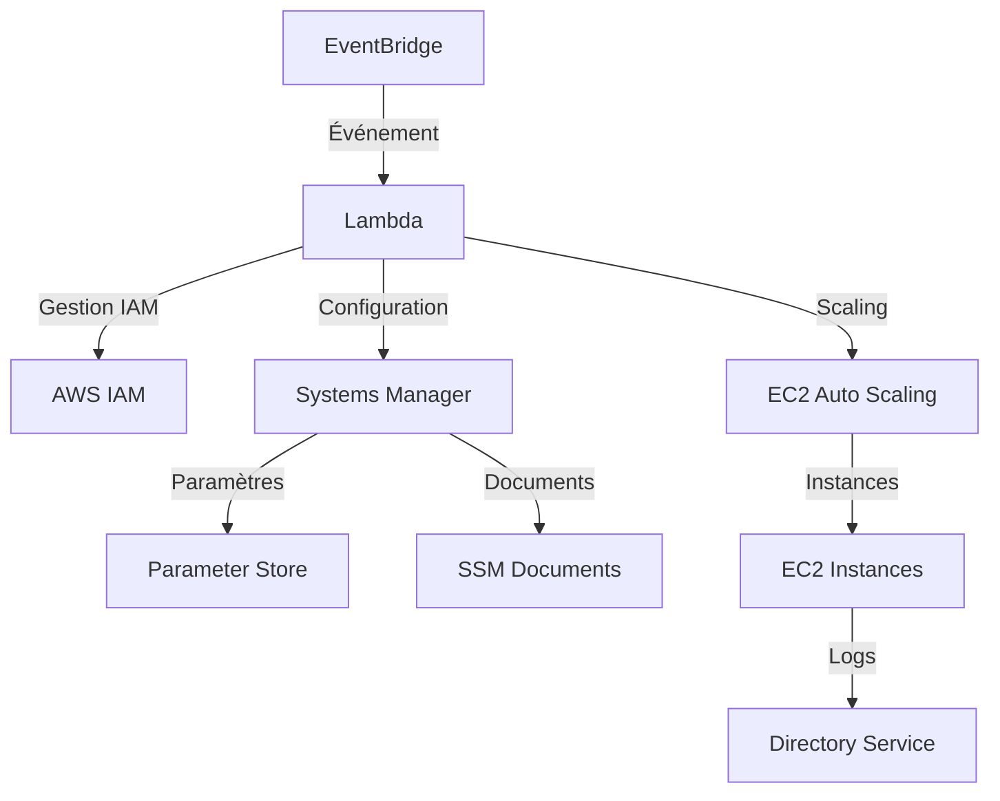

# AWS Automation Infrastructure

Ce projet implémente une infrastructure AWS complète d'automatisation utilisant Terraform, suivant les meilleures pratiques de modularité, sécurité, tests et réutilisabilité.

## Architecture

L'infrastructure comprend les services suivants :

1. **Amazon EventBridge** - Déclenche les événements d'automatisation
2. **AWS Lambda** - Traite les événements et orchestre les services
3. **AWS IAM** - Gère les permissions et rôles
4. **Amazon EC2 Auto Scaling** - Gère la scalabilité des instances
5. **AWS Systems Manager** - Configuration et gestion des instances
6. **Systems Manager Parameter Store** - Stockage sécurisé des paramètres
7. **AWS Directory Service** - Service d'annuaire managé

## Structure du Projet

```
aws-infrastructure/
├── main.tf                    # Orchestration principale
├── variables.tf               # Variables globales
├── outputs.tf                 # Outputs globaux  
├── versions.tf                # Configuration providers
├── terraform.tfvars.example   # Exemple de configuration
├── modules/                   # Modules Terraform
│   ├── iam/                   # Rôles et politiques IAM
│   ├── lambda/                # Fonction Lambda
│   ├── eventbridge/           # Règles EventBridge
│   ├── ec2/                   # VPC, EC2, Auto Scaling
│   ├── ssm/                   # Systems Manager
│   └── directory/             # Directory Service
├── environments/              # Configurations par environnement
│   └── dev/
├── scripts/                   # Scripts de déploiement
└── tests/                     # Tests automatisés
```

## Démarrage Rapide

### Prérequis

- [Terraform](https://www.terraform.io/downloads.html) >= 1.0
- [AWS CLI](https://aws.amazon.com/cli/) configuré
- Compte AWS avec les permissions appropriées

### 1. Cloner et Configurer

```bash
git clone <repository-url>
cd aws-infrastructure

# Copier et personnaliser la configuration
cp terraform.tfvars.example terraform.tfvars
```

### 2. Configurer le Backend S3

Créez un bucket S3 et une table DynamoDB pour le state Terraform :

```bash
# Créer le bucket S3 (remplacez par votre nom unique)
aws s3 mb s3://votre-terraform-state-bucket --region us-west-2

# Créer la table DynamoDB pour le verrouillage
aws dynamodb create-table \
  --table-name terraform-state-lock \
  --attribute-definitions AttributeName=LockID,AttributeType=S \
  --key-schema AttributeName=LockID,KeyType=HASH \
  --provisioned-throughput ReadCapacityUnits=1,WriteCapacityUnits=1 \
  --region us-west-2
```

Mettez à jour `environments/dev/backend.tf` avec vos informations.

### 3. Personnaliser la Configuration

Éditez `terraform.tfvars` :

```hcl
# Informations obligatoires
aws_region   = "us-east-1"
environment  = "dev" 
project_name = "mon-projet"
owner        = "MonEquipe"

# Mots de passe sécurisés (utilisez AWS Secrets Manager en production)
directory_password = "MonMotDePasseTresSecurise123!"
database_connection_string = "postgresql://..."
primary_api_key = "ma-cle-api-primaire"
secondary_api_key = "ma-cle-api-secondaire"
```

### 4. Déployer

```bash
# Utiliser le script de déploiement (recommandé)
chmod +x scripts/deploy.sh
./scripts/deploy.sh dev plan    # Voir le plan
./scripts/deploy.sh dev apply   # Déployer

# Ou manuellement
terraform init -backend-config=environments/dev/backend.tf
terraform plan -var-file=terraform.tfvars
terraform apply -var-file=terraform.tfvars
```

## Configuration Détaillée

### Configuration Lambda

La fonction Lambda est écrite en Python et gère :

- **Événements programmés** : Maintenance régulière
- **Changements d'état EC2** : Configuration automatique des instances
- **Événements Auto Scaling** : Réaction aux changements de capacité
- **Intégration SSM** : Exécution de commandes et gestion des paramètres

### Configuration EventBridge

Les règles EventBridge déclenchent la Lambda sur :

- **Événements programmés** : `rate(5 minutes)` par défaut
- **Changements d'état EC2** : Running, Stopped, Terminated
- **Événements Auto Scaling** : Launch/Terminate Success/Failure

### Configuration SSM

Systems Manager fournit :

- **Parameter Store** : Stockage sécurisé des configurations
- **Documents SSM** : Scripts de configuration des instances
- **Run Command** : Exécution de commandes à distance
- **Session Manager** : Accès sécurisé aux instances

## Sécurité

### Meilleures Pratiques Implémentées

- **Principe du moindre privilège** : Rôles IAM avec permissions minimales
- **Chiffrement** : Paramètres SSM chiffrés avec KMS
- **Réseaux privés** : Instances dans des sous-réseaux privés
- **Security Groups** : Règles de pare-feu restrictives
- **Logs** : CloudWatch Logs pour audit et monitoring

### Variables Sensibles

**Ne jamais** commiter de valeurs sensibles dans le code !

Utilisez une de ces méthodes en production :

```bash
# Variables d'environnement
export TF_VAR_directory_password="..."

# AWS Secrets Manager
aws secretsmanager create-secret --name "/aws-automation/dev/directory-password"

# Fichier .tfvars local (non versionné)
echo "terraform.tfvars" >> .gitignore
```

## Tests

### Tests Automatisés

```bash
# Tests unitaires avec Terratest
cd tests
go test -v -timeout 20m

# Tests de validation
terraform validate
terraform fmt -check -recursive
```

### Tests Manuels

```bash
# Tester la fonction Lambda
aws lambda invoke \
  --function-name aws-automation-dev-automation \
  --payload '{"source":"manual.test"}' \
  response.json

# Vérifier les paramètres SSM
aws ssm get-parameter --name "/aws-automation/dev/config"

# Vérifier l'Auto Scaling Group
aws autoscaling describe-auto-scaling-groups \
  --auto-scaling-group-names aws-automation-dev-asg
```

## Monitoring et Logs

### CloudWatch Dashboards

Les métriques suivantes sont collectées :

- **Lambda** : Invocations, erreurs, durée
- **EC2** : CPU, mémoire, disque
- **Auto Scaling** : Capacité, instances saines
- **EventBridge** : Règles déclenchées, succès/échecs

### Logs Centralisés

- **Lambda Logs** : `/aws/lambda/aws-automation-*`
- **EC2 Logs** : `/aws/ec2/var/log/messages`
- **SSM Logs** : Stockés dans S3
- **EventBridge Logs** : `/aws/events/aws-automation-*`

## Workflow EventBridge → Lambda



## Dépannage

### Problèmes Courants

**1. Erreur de permissions IAM**
```bash
# Vérifier les rôles
aws iam list-roles --query 'Roles[?contains(RoleName, `aws-automation`)]'
```

**2. Lambda timeout**
```bash
# Augmenter le timeout
lambda_timeout = 600  # 10 minutes
```

**3. Auto Scaling ne fonctionne pas**
```bash
# Vérifier les alarmes CloudWatch
aws cloudwatch describe-alarms --alarm-names aws-automation-dev-high-cpu
```

### Logs de Debug

```bash
# Logs Lambda
aws logs describe-log-streams \
  --log-group-name /aws/lambda/aws-automation-dev-automation

# Logs EC2 User Data
aws logs get-log-events \
  --log-group-name /aws/ec2/user-data \
  --log-stream-name i-1234567890abcdef0
```

## Nettoyage

```bash
# Destruction complète
./scripts/deploy.sh dev destroy

# Ou manuellement
terraform destroy -var-file=terraform.tfvars -auto-approve
```

## Évolutions Futures

- [ ] Multi-région avec réplication
- [ ] Intégration avec AWS Config
- [ ] Notification SNS/Slack
- [ ] Dashboard Grafana
- [ ] CI/CD avec GitHub Actions
- [ ] Backup automatique avec AWS Backup

## Contribution

1. Fork du projet
2. Créer une branche feature (`git checkout -b feature/nouvelle-fonctionalite`)
3. Commit des changes (`git commit -am 'Ajout nouvelle fonctionnalité'`)
4. Push vers la branche (`git push origin feature/nouvelle-fonctionalite`)
5. Créer une Pull Request
